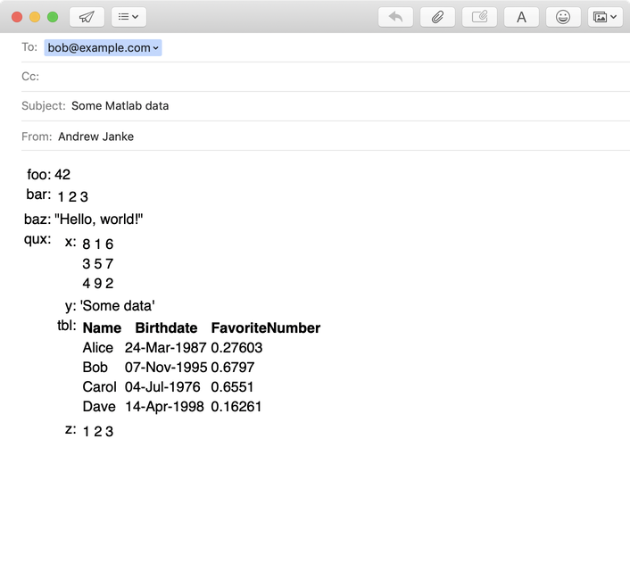

# fancyclip

[](https://travis-ci.com/github/janklab/fancyclip)  [](https://www.mathworks.com/matlabcentral/fileexchange/87002-fancyclip)

Superior clipboard copy and paste for Matlab

## About

Supports copying as HTML or JSON, pasting to Excel as tabular data, copying tables and structs, and more.

## What it does

Let's say you've got some data in a matrix, and you want to copy it into an Excel worksheet. So you use Matlab's `clipboard()` function and paste it in to your Excel.

```matlab
mx = magic(5) + round(rand(5), 2);
clipboard('copy', mx);
```


Darn it, that's not what I wanted!

Fancyclip can do better:

```matlab
fancyclip.copy(mx)
```


That's better!

You can use it on `table` arrays, too:

```matlab
Name = ["Alice" "Bob" "Carol" "Dave"]';
Birthdate = [datetime(1987, 3, 24), datetime(1995, 11, 7), datetime(1976, 7, 4), ...
  datetime(1998, 4, 14)]';
FavoriteNumber = rand([4 1]);
tbl = table(Name, Birthdate, FavoriteNumber);

fancyclip.copy(tbl)
```


Nice!

You can also paste into HTML emails, and use it on things like complicated nested `struct` arrays:

```matlab
s = struct('foo', 42, 'bar', [1 2 3], 'baz', "Hello, world!", 'qux', ...
  struct('x', magic(3), 'y', 'Some data', 'tbl',tbl, 'z', 1:3));

fancyclip.copy(s)
```



Yay!

Yay, Fancyclip!

## Installation

To install Fancyclip, download it from the [Releases page](https://github.com/janklab/fancyclip/releases) or clone the [repo](https://github.com/janklab/fancyclip) to get it on your disk. Then add its `Mcode/` folder to your Matlab path.

## Usage

### Examples

```matlab
% Load library
addpath Mcode

% Copy stuff to clipboard

x = magic(4) + rand(4);
fancyclip.copy(x);

s = struct('foo', 42, 'bar', [1 2 3], 'baz', "Hello, world!", 'qux', struct('x', magic(3), 'y', 'Some data', 'z', 1:3));
fancyclip.copy(s);

% Paste from clipboard in various formats

html = fancyclip.paste('text/html')

% See what's available on the clipboard

fancyclip.availableDataFlavors
```

See the [Fancyclip website](https://fancyclip.janklab.net) for more info.

## Author

Fancyclip is written and maintained by [Andrew Janke](https://your-website.com). The project home page is <https://github.com/janklab/fancyclip>.

## Acknowledgments

This project was created with [MatlabProjectTemplate](https://github.com/apjanke/MatlabProjectTemplate) by [Andrew Janke](https://apjanke.net).
